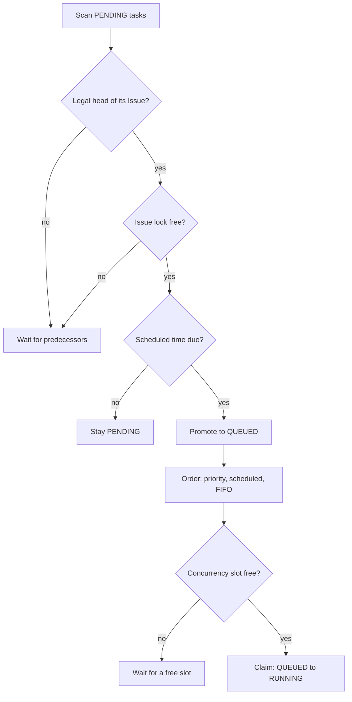

## Queue and priority arbitration

Scheduling is the difference between "the work exists" and "the work is running". Codify keeps that difference explicit with three states:

- **Pending** — created, not yet eligible to run.
- **Queued** — eligible, waiting for capacity.
- **Running** — claimed by a worker.

The scheduler polls on a fixed interval — configured as **Scheduler Interval (seconds)**, "how often the scheduler checks for work" — and on each cycle promotes only the *legal head* of each unlocked Issue from **Pending** to **Queued**. A Task that is not the head of its Issue is never promoted, no matter how high its priority.

Among the eligible heads, Codify picks in this order:

1. Priority ascending — **P0 (Highest)**, then **P1 (High)**, then **P2 (Normal)**.
2. Scheduled Tasks before immediate Tasks, because a user who booked a slot expects it to run near that time.
3. Earlier scheduled times first.
4. Creation order as the final tiebreaker, oldest first.

Monitor prints the same rule in one line: Running → Ready (Priority P0 first, then due scheduled before immediate, then earlier schedule first, then FIFO) → Waiting, with waiting tasks sorted by scheduled time.

Two consequences matter in practice. First, priority arbitrates *between* Issues only — it can never reorder the turns inside one Issue. Second, a queued Task belonging to a busy Issue is filtered out of the candidate query, so it cannot sit at the head of the global order and starve runnable work from other Issues.

The claim itself is atomic. The scheduler takes the Issue row lock, re-checks the Task's turn number, and only then moves it from **Queued** to **Running**. Candidate selection is never the authority; the locked re-read is.

## Concurrency and per-issue mutex

Two limits interact.

**Global concurrency** — **Max Concurrency** is described as the maximum number of tasks that can run at the same time. When all slots are taken, eligible Tasks stay **Queued** with the message that they will start automatically when capacity becomes available.

**Per-issue mutex** — only one Task per Issue may run at a time. The scheduler holds an execution lock on the Issue for the whole run and releases it only after the Task is terminal *and* its container reference is gone. This is what makes the shared workspace and the shared session safe: two Tasks on the same Issue can never write the same checkout concurrently.

The practical effect is that an Issue behaves like a long-lived CLI session. You can append as many Tasks as you like and schedule them freely; they execute strictly in turn order, one after another, each one seeing the results of the previous turn.

Because of the mutex, a Task that is the head of a busy Issue stays **Queued** while its predecessor runs, and the task page reports the reason — for example that it is waiting for the Task ahead of it to complete, or that it is queued at a specific position.

## Schedule windows and slot capacity

Scheduling a Task has two independent constraints.

**The Issue queue window.** Within one Issue, scheduled times must stay monotonic. A new or rescheduled Task cannot be earlier than the latest scheduled time of any earlier active Task, and cannot be later than the earliest scheduled time of any later active Task. The UI reports the violation as a floor or ceiling constraint naming the Task that causes it, and shows the available window when one exists. If no valid window exists for that Issue's queue, the form says so and refuses the time.

**Slot capacity.** Separately from the queue window, an administrator can cap how much work lands in the same hour:

| Setting | Meaning |
|---|---|
| **Max Tasks per Hour Slot** | Maximum number of tasks that can be scheduled in the same 1-hour window. `0` means unlimited |
| **Enforce Slot Limit** | When enabled, reject task creation if the target hour slot is full. Otherwise, show a warning only |

The task form and the **Schedule Load (7 days)** preview expose this before you commit. Clicking a cell selects that hour; darker cells mean more tasks are already scheduled there. When a slot fills up you get one of two responses:

- **Time slot {start}–{end} is near/at capacity ({count}/{max} tasks).** — a warning; creation can proceed.
- **Time slot {start}–{end} is at full capacity ({count}/{max} tasks). Task creation is blocked.** — enforcement is on and the slot is full.

Schedule Overview renders the same data at platform scale. **Next 24 Hours** counts scheduled tasks per hour, **Busy & Idle Windows** summarises the same window, and the **7-Day Heatmap** marks cells **Light**, **Busy**, or **Full** with a **{count}/{max}** readout per cell. Times in these views are shown in UTC+8.

Slot capacity counts what is *scheduled*, not what is running. It is a planning guard against landing twenty Tasks on the same hour, not a runtime throttle.

## Timeout policy

Every Task has a maximum execution time, chosen from a two-tier policy configured under **Task Timeout Policy**:

| Setting | Meaning |
|---|---|
| **Peak start time** / **Peak end time** | The daily peak window, in strict 24-hour `HH:mm`. Start is inclusive and end is exclusive |
| **Peak timeout (seconds)** | Limit applied to runs that start inside the window |
| **Off-peak timeout (seconds)** | Limit applied to runs that start outside it |

Both limits must be between 60 and 28800 seconds. The window is evaluated in the business timezone shown next to the policy — as **Business timezone: {timezone}** — so the peak window is a human working-hours concept rather than a UTC artifact. If a deployment sets the window so that it wraps past midnight, the peak range is the span from start to end through midnight; setting both ends to the same value is rejected.

The tier is selected once, at the moment the Task enters **Running**, and is then frozen for that execution. Each Task selects one limit when it enters RUNNING and keeps it while running. This is deliberate: a long run that started at 08:59 does not inherit a new, shorter limit halfway through.

The task page surfaces the frozen value honestly:

- **Execution deadline** — the absolute time the run must finish by.
- **Execution timeout** — how many seconds it was given.
- **Determined when execution starts** while the Task has not started, and **Not recorded for this execution** for executions from before the field existed.

A run that exceeds its limit fails with the failure type **Timeout**. Increase the limits when legitimate work is being cut off; do not read a timeout as a model problem until you have checked the log for progress near the deadline.

## Crash recovery

Codify assumes the scheduler and its workers can die at any moment, and reconciles state on startup rather than leaving Tasks stranded.

On start, the scheduler reconciles in-memory state against the database, releases locks left behind by Tasks that are no longer running, and then walks every Task that is still **Running** or still holds a container reference. For each one it probes the Docker target and takes one of four actions:

| Situation | Action |
|---|---|
| Container running, Task **Running** | Resume monitoring the container |
| Container exited, Task **Running** | Resume, collecting logs and results from the exited container |
| Container running or exited, no matching Task | Remove it as an orphan container |
| Task **Running**, no container | Mark the Task **Failed** |

If a Docker target is unreachable, recovery retries with bounded backoff and keeps the Task owned rather than guessing; an unknown remote worker is not silently failed. Terminal containers that still hold raw logs are retained until the logs are finalized, and only then cleaned up.

Two related guards are worth knowing as a user:

- A retained container keeps its Issue unavailable until it is gone, so a Task immediately after a crash may report that it is waiting for its predecessor to clean up the workspace.
- Recovery never resets a Task's turn number or reorders the queue. If an Issue's sequence is found to be inconsistent, the scheduler repairs it under the Issue lock; while repair is pending, new scheduling for that Issue is temporarily unavailable and says so.
