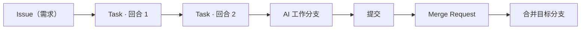

## Issue

Issue（界面标签为「需求」）是 Codify 的工作单元：一个要解决的问题，以及围绕它产生的全部执行记录。你在「需求」页创建它，填写标题、描述、所属项目、起始分支与合并目标。

需求的关键字段如下：

| 字段 | 说明 |
|------|------|
| 标题 | 需求的简短名称，会用于 MR 标题 |
| 描述 | 这个需求要做什么，作为创建任务时的默认提示词 |
| 项目 | 所属 GitLab 项目 |
| 起始分支 | AI 拉取代码的基线分支 |
| 合并目标 | MR 的合并目标分支 |
| 分支策略 | 工作分支的创建与清理方式 |
| 会话 ID | 该需求当前 AI 会话的标识 |
| 任务数 | 需求下累计的任务数量 |

描述会作为创建任务时的默认提示词，因此写得越具体，任务效果越好。需求还有一组状态：待处理、进行中、待审查、已关闭。需求详情页汇总了它的执行记录、需求上下文与交付概览。

需求是**分支、工作区与会话**的所有者。同一个需求下的所有任务共享同一条工作分支和同一份工作区，这是「追加任务」能够接着上次继续推进的前提。

## 任务与回合

Task（界面标签为「任务」）是需求的一次执行。每次执行都会分配一个不可变的回合序号，界面上显示为「回合 #{sequence}」。同一需求内的任务按回合序号串行推进：只有队首任务会真正运行，其余任务排队等待前序完成。

任务详情页 `/tasks/:id` 是操作中心，包含：

- 「当前执行」与「执行结论」，显示状态、模式、队列位置与失败原因
- 「任务概览」「执行上下文」「执行数据」，显示项目、分支、时间与 MR 元数据
- 「日志」面板与「运行统计」
- 「操作」区，只展示当前状态下安全可用的按钮

任务可能由不同来源触发，详情页会标注触发来源：

| 触发来源 | 含义 |
|----------|------|
| 手动 | 在需求上正常创建的任务 |
| 重试 | 由失败或取消的任务重试而来，并显示「重试自」源任务 |
| 接续任务 | 追加的后续回合 |
| CI 自动修复 | MR 流水线失败后由系统自动创建的修复任务 |

若任务没有关联需求，副标题会显示「手动任务」。任务与需求的关系不是一对一的：一个需求可以有许多回合。

## Harness

Harness 是容器内真正调用模型的执行引擎。创建任务时可选的标签为 Claude、Codex、Pi、OpenCode，具体可用项由需求的 Worker 配置决定。每个任务在创建时冻结自己的 Harness 选择，续跑任务必须沿用当前 Harness；要切换 Harness，需要勾选「使用新会话执行」开启新一代会话。

Harness 决定了模型协议（Claude 使用 Anthropic 协议，Codex 使用 OpenAI 协议）、可用的运行指令模板，以及是否支持实时引导。任务详情页的「Harness」行与「执行模型」行会显示实际使用的引擎和模型。

## 工作区、会话与分支

三者都以**需求**为作用域，而不是以任务为作用域。

- **工作区**：容器挂载的需求级目录。仓库、Harness 配置与会话数据都在其中，任务之间复用，因此上一个任务留下的提交会成为下一个任务记录中的「前序任务提交」。需求闲置超过保留期后工作区才会被回收。
- **会话**：AI 对话的上下文。默认「继续会话」，新任务会续接该需求既有的会话；勾选「使用新会话执行」则开启新一代会话，不继承当前对话上下文，但保留工作区、Git 分支和旧会话记录。
- **分支**：需求持有唯一的 AI 工作分支，从「起始分支」创建，之后通过 Merge Request 合并进「合并目标」。任务本身没有独立分支。

会话按代（generation）管理，任务上冻结的会话策略只有两个取值：`continue`（续接当前会话）与 `fresh`（新开一代会话）。如果续跑任务的 Harness 与当前会话不一致，界面会要求改为新会话后继续。

工作区与会话会随需求长期保留：工作区默认在闲置超过保留期后由调度器清理，运行归档默认保留 30 天。清理不会删除任务记录本身。

## 任务快照与运行时包

创建任务时会冻结两份不可变内容，之后的配置变更不会影响已创建的任务。

**任务快照（Task Snapshot）** 记录这次执行使用的 Worker 与模型服务身份：Worker 配置、镜像、Worker Kit 版本与路径、挂载、环境变量、Harness 与适配器版本、模型端点、凭据引用、预置脚本，以及实施模式与分析模式的默认运行指令模板。任务详情页的「任务快照」区块展示这些信息，环境变量只显示键名、类型和是否已配置，不会返回值。

**运行时包（Runtime Bundle）** 是内容寻址的执行工件集合，按冻结的镜像身份、Worker Kit 身份与 Harness 验证证据计算摘要。任务执行时只从冻结的快照解析模型配置，凭据是唯一在运行时读取的部分。

任务详情页会显示模型服务的执行快照（「执行快照」标记）或当前配置（「当前配置」标记），并给出快照时间。如果关联的模型服务配置已被删除，页面只能展示任务保留的实际模型信息。重试会克隆源任务的快照并重新绑定运行时包，因此重试不会受后来配置改动的影响。

## 交付物

任务的产出分三层，都在任务详情页可查：

| 交付物 | 位置 | 说明 |
|--------|------|------|
| 提交记录 | 「提交记录」区块 | 本次提交与前序任务提交，含提交 SHA 与摘要 |
| 合并请求 | 「合并请求」区块 | MR 地址、标题与创建状态；无 MR 时显示「不创建 MR」 |
| 运行归档 | 「运行归档」区块 | 可下载的事件流、日志与制品压缩包 |

此外还有两个统计维度：「代码变更」给出 `+新增 -删除` 行数，「Token 用量」给出本次调用的输入与输出 token 数。它们会进入仪表盘与统计分析的趋势图。

运行过程本身也是可回看的证据：结构化「事件流」记录思考、工具调用与子代理，「原始日志」保留容器输出，两者都能在日志面板中切换查看。

交付摘要由 Harness 生成，显示在「AI 交付摘要」卡片中，可用「放大查看交付摘要」展开阅读。

## 产品全景

上面是一条 Issue 的完整生命周期，而平台整体由六块构成：核心引擎（需求、任务、调度、执行）、数据与洞察、配置中心、协作与集成、平台治理，以及前端基础设施。完整关系维护为一张源图：

[打开 Codify 功能地图](assets/feature-map.svg) — 大图，单独打开查看，保证每个方框都清晰可读。
