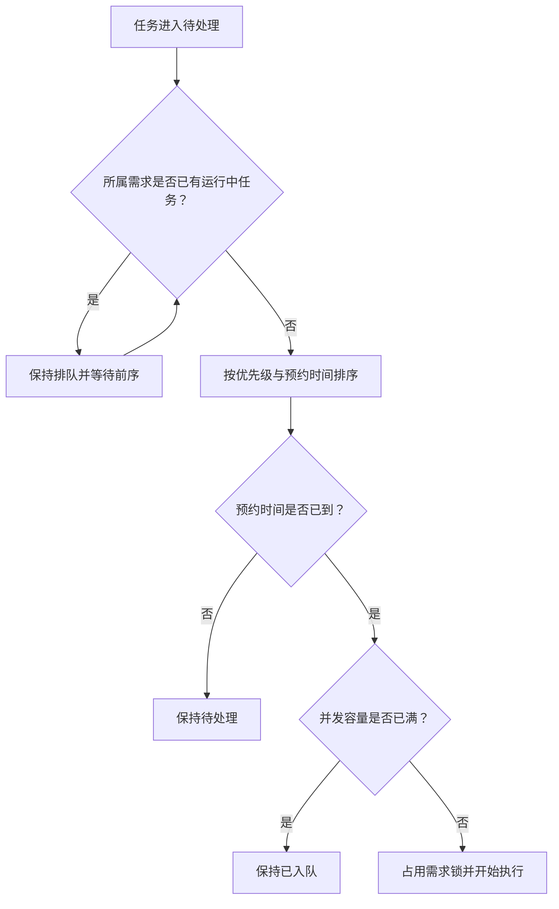

## 队列与优先级仲裁

调度器是一个独立的进程，按固定间隔轮询待执行工作，这一间隔由运行时的「调度间隔（秒）」控制，含义是「调度器检查工作的频率」。它每一轮做三件事：把符合条件的需求队首从待处理提升为已入队，检查并发容量，然后从已入队任务里挑一个真正执行。因此从条件满足到状态发生变化之间，最多会有一个调度间隔的延迟。

出队顺序由四个键依次决定：

1. 优先级：P0 → P1 → P2。
2. 已到期的预约任务优先于立即执行任务。
3. 预约时间更早的优先。
4. 创建时间更早的优先；完全相同则按任务 ID。

队列位置是**活跃任务之间的相对排名**：终态任务不占位置，非队首任务会显示「排队第 {position} 位 · 等待 Task #{blockedBy}」。被阻塞的任务不会占用并发名额，因此不会拖慢其他需求的进度。

更细的阻塞原因会直接显示在任务详情页与监控页的看板上，例如：

- 「队首 · 预约等待」：已经排到队首，但预约时间还没到。
- 「队首 · 等待 Worker」：已经排到队首，等待空闲的并发容量。
- 「等待 Task #{blockedBy} 清理工作区」：前序任务已结束，容器还在清场。

## 并发与同需求互斥

任务详情页与监控页都会显示「{count}/{max} 并发」，其中 `max` 来自运行时的「最大并发数」，含义是「同一时间允许运行的任务最大数量」。超过上限时，新任务只会停留在已入队状态，等有容量释放后自动开始。

除全局并发外，还有一层**需求级互斥**：同一条需求下同一时间只能有一个任务在运行。调度器同时用内存集合与数据库中的需求执行锁两层机制保证这一点。因此：

- 同一需求的多个回合天然串行，后面的回合会等到前面的回合彻底释放需求锁。
- 需求锁的释放不只看任务是否终态，还要看容器是否已经清理完毕，所以排队中的任务可能显示「等待 Task #{blockedBy} 清理工作区」。
- 需要并行推进的多件事，应该拆到不同需求下，而不是在一条需求里堆多个任务。

如果某条需求的回合序号出现异常，调度器会暂停该需求的调度，并在监控页提示「{count} 个任务需要回合序号修复，调度暂不可用」，这属于需要管理员介入的状态。

## 预约窗口与时段容量

预约执行的粒度是**小时**。同一个小时内的预约任务构成一个时段，时段的可用容量由管理员在「系统配置」的「运行时设置」中通过「时段容量」配置：

- 「每小时时段最大任务数」：同一小时时段内可预约的最大任务数，`0` 表示不限制。
- 「强制执行时段限制」：开启后目标时段满载会直接拒绝创建任务；关闭则只显示警告。

创建任务时的「近7日预约热力图」按小时着色，颜色越深表示该时段计划负载越高；鼠标悬停显示「{count}/{max}」。统计口径与创建校验一致：只统计该小时内处于待处理、已入队或执行中、且带预约时间的任务。满载时显示「时段 {start}–{end} 已满载（{count}/{max} 个任务）」。「调度总览」页还会单独列出「满载时段」，并提示「时段容量：每小时 {capacity} 个」。

除容量之外，同一条需求队列内的预约时间还有顺序约束：新任务不得早于前序任务的最早执行时间，也不得晚于后续任务的最晚执行时间，界面会给出「Issue 队列可预约窗口：{min} – {max}」。若每个可取值都被占用，会提示「该 Issue 队列当前不存在有效的可预约窗口」。

创建后调整时间同样受这两层约束：修改预约只对仍处于待执行状态的预约任务开放，并且必须选择一个未来的时间点。

## 超时策略

任务超时按**高峰 / 低峰**两档配置，管理员在「系统配置」的「运行时设置」中通过「任务超时策略」维护：

| 配置项 | 含义 |
|--------|------|
| 高峰开始时间 / 高峰结束时间 | 24 小时制 `HH:mm`；开始时间包含，结束时间不包含 |
| 高峰超时（秒） | 高峰时段内开始的任务的超时上限 |
| 低峰超时（秒） | 其余时段内开始的任务的超时上限 |

策略按业务时区（Asia/Shanghai）判定。超时上限的取值范围是 60–28800 秒，并且**在任务进入执行中的那一刻冻结一次，运行中不会切换**：任务 17:59 开始执行，就使用高峰值直到结束，即使跨过了 18:00。

两点容易混淆的地方：

- 档位只取决于开始执行的时刻，与任务优先级无关。
- 超时与用户取消是两种不同的结局：前者以失败收尾，后者以已取消收尾。

任务详情页在开始执行后显示「本次超时上限」与「执行截止时间」；未开始的任务分别显示「开始执行时确定」与「本次执行未记录」。超时属于权威的失败结论：容器会被停止，任务以「失败」结束，失败类型标记为「超时」。

## 崩溃恢复

调度器启动时会先做一次崩溃恢复，再开始派发新任务。恢复逻辑以任务的运行状态与容器为准：

- 任务仍标记为运行中、容器仍存在：接管监控，继续等待执行结果。
- 任务仍标记为运行中、容器确认不存在：将任务标记为失败（若期间收到过取消请求则标记为已取消），并释放需求锁。
- 容器存在但已没有对应任务：判定为孤儿容器并清理。
- 已取消的任务仍有容器在跑：先停止容器，再完成收敛。

调度器通过固定命名规则识别 Worker 容器：容器名形如 `codify-<任务 ID>-issue<需求 ID>`，前缀由部署配置控制。即便容器前缀被改动，运行中任务的恢复仍以任务上记录的容器 ID 为准，不会因此漏掉正在跑的 Worker。

恢复期间如果 Docker 目标不可达，调度器会保持需求锁并定期重试，避免在状态未知时把任务判死；确认不可达后才会释放。

除恢复之外，调度器还周期性地做后台清理：需求工作区按保留期回收，运行归档按保留期删除记录与文件，控制台会话按保留期清理，终态任务残留的容器会被强制移除。所有这些清理都只影响运行时数据，不会改动任务本身的历史记录。
