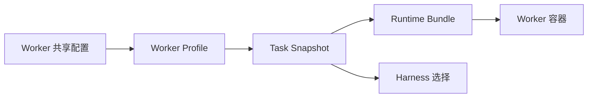

## 配置总览

**系统配置** 页面（`/configuration`）是 Codify 唯一的运行时配置入口，只有平台管理员可以打开。页面把配置分成多个选项卡，每个选项卡可以独立保存。

| 选项卡 | 作用 |
|---|---|
| **运行与共享** | 调度器、任务超时、时段容量、重试与告警、共享页面访问 |
| **认证与会话** | GitLab OIDC、Cookie 会话策略、管理员引导、OIDC 诊断 |
| **GitLab** | GitLab 连接与项目 Webhook 总览 |
| **AI 模型服务** | 任务执行使用的模型服务端点 |
| **提示词模板** | 任务创建时可复用的提示词模板 |
| **Worker** | Worker 设置、共享配置与 Worker Profile |
| **Skills** | 系统管理的 Skill 目录包 |
| **通知** | Mattermost 连接与通知配置 |
| **公告** | 顶栏系统公告 |
| **维护操作** | 重新加载配置、重置为环境变量/默认值、系统数据清理 |
| **Webhook 事件** | 已接收的 GitLab Webhook 事件日志 |

保存后的值会覆盖环境变量配置，并在重启后保留。每个字段旁的来源标签说明当前生效值的层次：**已同步**、**数据库覆盖**、**环境变量回退**、**默认值回退**。页面顶部在存在改动时显示 **有未保存修改**，每个分区用 **保存修改** 提交、**还原修改** 放弃本次编辑。

敏感密钥仅存储在服务端，永远不会返回到浏览器。将密钥输入框留空即可保留当前已存储的值；需要轮换时输入新值，需要撤销时使用对应的清除按钮（例如 **清除已存储 OIDC 密钥**）。密钥状态字段只显示 **已配置** 或 **缺失**。

```text
数据库覆盖  >  环境变量  >  内置默认值
```

部署期的 `CONFIG_ENCRYPTION_KEY` 用于加密这些密钥。更换或丢失该值时，已存储的密钥无法解密，配置读取和保存都会失败。

## 运行时与容量

### 调度器

**最大并发数** 限制同一时间允许运行的任务数量，**调度间隔（秒）** 决定调度器检查工作的频率，**默认目标分支** 是任务未指定目标分支时使用的分支。

### 任务超时策略

**任务超时策略** 使用业务时区，字段旁显示 **业务时区：{timezone}**（当前部署为 `Asia/Shanghai`），把一天切成高峰和低峰两段。

| 字段 | 说明 |
|---|---|
| **高峰开始时间** / **高峰结束时间** | 严格使用 24 小时制 HH:mm；开始时间包含，结束时间不包含，两者不能相同 |
| **高峰超时（秒）** | 高峰时段允许的最大执行时间 |
| **低峰超时（秒）** | 低峰时段允许的最大执行时间 |
| **本次超时上限** | 任务进入 RUNNING 时选择一次超时上限，运行中不会切换 |

超时值范围为 60–28800 秒，并在任务开始执行时冻结。超时是权威结果：超过上限的任务会以 **失败** 结束，错误信息形如 `Task timed out after <秒数>s`，即使 Harness 同时上报了取消也会按超时处理。

### 时段容量

**每小时时段最大任务数** 限制同一 1 小时时段内可预约的任务数，0 表示不限制。**强制执行时段限制** 开启后，目标时段满载时将拒绝创建任务；关闭则仅显示警告。被拒绝时提示 **时段 {start}–{end} 已满载（{count}/{max} 个任务），任务创建已被拒绝。**（创建向导内的提示文案为 **时段 {start}–{end} 已满载（{count}/{max} 个任务）。**）

### CI 自动修复

**CI 最大修复次数** 是每个跟踪 MR 最多自动创建的修复任务数；0 表示不自动创建修复任务。自动修复依赖项目 Webhook 的完整检查项，详见下一节。

### 重试与告警

**最大重试次数** 是失败任务允许自动重新入队的次数，**重试延迟（秒）** 是再次入队前的等待时间。开启 **失败时告警** 后，任务失败时会向 **告警 Webhook URL** 发送通知；**告警 Webhook 状态** 只显示是否已存储，URL 本身不会返回到浏览器。

### Worker 设置

**Worker 设置** 分区包含两组容量相关配置。

| 分区 | 字段 |
|---|---|
| **Workspace 清理** | **Worker 本地 Workspace 路径**、**Workspace 保留天数** |
| **任务产物** | **总大小上限（MiB）**、**单文件上限（MiB）**、**文件和目录总数上限**、**运行归档保留天数** |

**Worker 本地 Workspace 路径** 是在目标 Docker daemon 主机上解析的绝对路径，各 Worker 目录彼此独立，无需 NFS。该路径由 Backend、Scheduler 的 `WORKER_WORKSPACE_HOST_PATH` 指定，**不能** 在页面上修改：通过配置 API 提交它会返回冲突，必须修改环境变量并重新创建服务。**Workspace 保留天数** 到期后，无近期文件更新的 Issue workspace 和 CI 证据包会被定期清理，0 表示关闭自动清理。**运行归档保留天数** 到期后只删除运行归档，不删除对应的任务或需求。**单文件上限** 不能超过 **总大小上限**。

### 页面权限

**共享页面访问** 下的 **页面权限** 决定哪些只读页面也向平台普通用户开放。开关包括 **允许平台用户访问 Monitor**、**允许平台用户访问 Schedule Overview**、**允许平台用户访问 Analytics**；未开启时，普通用户访问对应页面会收到 403，并被引导回登录/无权页面。

## GitLab 与 Webhook

### GitLab 连接

**GitLab 连接** 分区维护三个值。

| 字段 | 说明 |
|---|---|
| **GitLab URL** | 用于 API 调用、页面链接和仓库操作的 GitLab 基础地址 |
| **GitLab Bot Token** | 任务执行使用的机器人令牌 |
| **GitLab Admin Token** | 仅用于项目 Webhook 管理 |

页面提供 **测试 GitLab 连接**，成功后显示连接地址、认证用户名与服务端版本。**清除项目缓存** 让缓存的项目列表失效，下一次读取会重新从 GitLab 拉取。

### Webhook 自动配置

**Webhook 总览** 列出当前 GitLab Admin Token 可见的所有项目及其 Webhook 健康状态，并支持逐行修复。

| 列 | 含义 |
|---|---|
| **项目** | GitLab 项目路径 |
| **状态** | **已配置**、**需关注**、**缺失** 或 **错误** |
| **Secret 模式** | **项目独立托管 secret** 或 **未配置本地 secret** |
| **检查项** | **Hook**、**Note**、**SSL**、**MR 事件**、**流水线事件** |
| **详情** | 命中的 hook 与失败原因 |

**筛选项目** 支持按项目路径、状态或 secret 状态搜索。选中单个项目后可用 **配置项目 Webhook** 一键创建或更新指向本系统的 Webhook，或用 **查看项目 Webhook 状态** 只做检查。

自动关闭 Issue 与 CI 自动修复都要求 **MR 事件** 处于启用状态；提示 **MR 事件未启用 — 请重新配置 Webhook 以启用自动关闭** 出现时，重新执行一次 **配置项目 Webhook**。若项目从未配置过本地 secret，系统会为该 Webhook 生成一个托管 secret 并加密存储。

### Webhook 事件

**Webhook 事件日志** 记录已接收的 GitLab Webhook 事件及处理结果，支持 **按结果筛选** 和 **按项目 ID 筛选**。**结果** 列可能的值包括 **Issue 已关闭**、**已是关闭状态**、**未匹配**、**不支持的事件**、**已忽略的操作**、**认证失败**、**CI 失败采集中** 和 **重复事件**。**认证失败** 说明请求未通过 secret 校验，通常是 Webhook 被外部修改或 secret 被重置。

## 登录与 OIDC

### 提供方基础信息

**GitLab OIDC** 分区配置身份提供方。**启用 OIDC 登录** 打开后，控制台 API 将要求通过 GitLab 登录；**Issuer URL**、**Client ID**、**Client Secret**、**回调地址** 必须与 GitLab OAuth 应用一致。回调地址通常应以 `/api/auth/callback` 结尾，OIDC 诊断会对此给出提示。**客户端密钥状态** 显示 **已配置** 或 **缺失**，真实密钥不会返回到浏览器。**测试 OIDC 连接** 会先做 issuer 发现，成功后报告发现到的 issuer 与所需 scopes。

### 会话与访问

**会话策略** 控制 Cookie 与会话记录的生命周期。**Session Cookie 名称** 是浏览器 Cookie 名，**Session TTL（秒）** 是会话有效期，**会话保留天数** 决定过期或已吊销的会话记录在此天数后自动删除。**Cookie Secure** 在 HTTPS 部署时应保持启用，**Cookie SameSite** 取值为 `lax`、`strict` 或 `none`，必须与部署方式匹配。**管理员引导** 用逗号分隔的 **管理员用户名** 和 **管理员 GitLab 组** 在登录时把匹配用户引导为平台管理员；组名是否可用取决于 GitLab OIDC 是否在 claims 或 userinfo 中返回 groups。

### OIDC 诊断

OIDC 诊断面板嵌在 **认证与会话** 选项卡底部，面板内的 **刷新诊断** 按钮可重新拉取快照。它由四部分组成：**认证模式概览**（**OIDC 登录**、**紧急入口**、**Client ID**、**客户端密钥**、**Cookie 策略**、**会话 TTL**）、**检查项**、**提供方元数据**（**Issuer URL**、**发现到的 issuer**、**回调地址**、**授权端点**、**令牌端点**、**用户信息端点**、**授权 scope 字符串**、**授权 URL 预览**）和 **必需 scopes**。

检查项状态只有 **正常**、**告警**、**错误** 三种。需要关注的固定 scope 为 `openid`、`profile`、`email`、`read_api`。**运维告警** 会在下列情况出现：回调地址路径不是 `/api/auth/callback`；HTTP 回调搭配 **Cookie Secure** 开启；HTTPS 回调搭配 **Cookie Secure** 关闭；**Session TTL** 超过 24 小时；SameSite=None 且 Cookie 不加密；以及启用了组管理员引导但 GitLab 未返回 groups。

## AI 模型服务

**AI 模型服务** 选项卡管理用于任务执行的模型服务端点。**添加服务** 打开创建表单，**编辑服务** 修改已有条目，每个条目包含下列字段。

| 字段 | 说明 |
|---|---|
| **名称** | 唯一标识符，只允许字母数字、连字符与下划线 |
| **接口地址** | API 基础地址 |
| **模型** | 任务执行时使用的模型标识符 |
| **Provider 类型** | **Anthropic 兼容** 或 **OpenAI 兼容** |
| **Wire 协议** | **Anthropic Messages**、**OpenAI Responses** 或 **OpenAI Chat Completions** |
| **最大轮次** | 每任务最大代理轮次（1–1000） |
| **API 密钥** | 留空保持现有密钥 |
| **系统提示词** | 附加到每次 AI 执行的系统指令 |
| **高级请求参数** | 合并进各兼容 Harness 请求体的 JSON 对象 |
| **状态** | **启用** 或 **禁用** |

Provider 类型与 Wire 协议必须搭配：`anthropic_compatible` 搭配 `anthropic_messages`，`openai_compatible` 搭配 `openai_responses` 或 `openai_chat_completions`。**系统提示词** 与 **高级请求参数** 会进入非敏感 Task Snapshot，因此不要在其中填写密钥；保留字段由 Harness 所有，提交时会报错。

**测试连通性** 会在不创建任务的前提下发起一次最小请求，成功时显示往返延迟。**设为默认** 把某个服务标记为 **默认**（当前默认项还带 **系统默认** 标签），新建任务默认选中它。**禁用** 后的服务不能在新建任务时选择，但已冻结的 Task Snapshot 不受影响。删除受两条规则约束：仍有活跃任务使用时提示 **无法删除 — 仍有活跃任务使用此服务**；只剩下唯一一个服务时提示 **无法删除唯一的服务**。

**运行与共享** 选项卡中的 Anthropic 兼容字段（**Anthropic Base URL**、**Anthropic API Key**、**Anthropic Model**、**Claude 最大轮次**）保存时会同步到默认服务，两处编辑的是同一份端点配置。

## Worker Profile

Worker 的执行环境由三层组成：系统的 **共享配置**、可复用的 **Worker Profile**，以及任务创建时冻结的 **Task Snapshot**。



### 共享配置

**共享配置** 是 **系统基线**，统一维护可继承的 Worker Kit、**公共挂载**、**公共环境变量**、**公共脚本** 和 **公共运行指令**。保存后，所有跟随系统值的 Profile 所创建的新任务会使用这份基线；已有 Task 快照不会变化。页面顶部显示 **修订版本 {revision}** 与 **更新于 {time}**，**保存共享配置** 使用乐观校验：如果共享配置已被其他人更新，保存会失败并提示 **共享配置已被其他人更新，请重新加载页面后再保存。**

**公共环境变量** 支持 **明文** 与 **密文** 两种 **值类型**；密文值在浏览器中不会再次显示，只保留键与配置状态。

### Profile 配置

**Worker 配置** 列表中的每个条目是一个 Worker Profile，**新建配置** 创建，**复制配置** 复制（加密的密钥值一并保留），**设为默认** 指定新任务的默认 Profile，**禁用** / **启用** 切换可用性。**删除** 只允许未被任何需求引用的已禁用配置。**强制禁用** 会同时关闭该 Profile 的所有未关闭需求，需要确认。

Profile 中的每个字段都可以 **跟随系统**，或改为 **Profile 覆盖**；对于继承来的条目，还可以选择 **在此 Profile 屏蔽**、**恢复系统值** 或 **恢复继承**。来源列会标出 **系统**、**Profile 覆盖**、**已在 Profile 屏蔽**、**Profile 新增**，被清空的值显示为 **（空）**（例如 **已覆盖为空：此 Profile 已禁用共享脚本。**）。

| 分区 | 可配置内容 |
|---|---|
| **Worker Kit** | **运行时交付方式**（**挂载 Worker Kit** 或已过时的 **镜像内置（已过时）**）、**Worker Kit 版本**、**Worker Kit 路径**、**跟随系统 Worker Kit** |
| **存储卷挂载** | **宿主机路径**、**容器内路径**、**挂载模式** |
| **环境变量** | **变量名**、**值类型**（**明文** / **密文**）、**变量值** |
| **自定义脚本** | **前置脚本**（checkout 后、AI 执行前在 `/workspace` 运行）、**后置脚本**（AI 执行成功后、提交前运行） |
| **运行指令** | **实施模式**、**分析模式**、**CI 自动修复** 三个模板 |
| **运行时交付方式** 之外的执行选择 | **Docker 目标**、**CodeGraph**、**Harness** 与 **默认 Harness**、**默认 Skills** |

**Worker Kit 路径** 是 Docker 主机上的绝对路径，Codify 会挂载到 `/opt/codify-kit`，并把其中的 `nix/store` 挂载到 `/nix/store`。**镜像内置（已过时）** 交付方式不支持 Skills；**默认 Skills** 要求 Worker Kit 0.3.5 或更高版本的挂载模式。**CodeGraph** 为使用该配置的任务启用本地 CodeGraph MCP 服务和项目索引。**Harness** 决定该配置下任务可用的 Harness，**默认 Harness** 会预选给新任务；启用多个时可逐任务切换。

**Docker 目标** 默认使用 **使用系统默认 Docker**，也可以指定 **Docker Host** 与 **TLS CA 路径**、**TLS 客户端证书路径**、**TLS 客户端密钥路径**。**测试连接** 在保存前验证目标 daemon；远程 TCP 端点未配置 TLS 时会给出明确警告。

### 运行时验证

**Profile 运行时验证** 检查该 Profile 解析出的 Worker Kit、镜像与 Harness 是否真正可执行。**验证运行时** 成功后条目显示 **已验证** 与 **已就绪**，并记录 **最近检查 {time}**；解析不出结论时显示 **未验证** 或 **运行时不可用**，**最近错误** 字段保留诊断详情。**Harness** 行会单独标出每个 Harness 是 **可用** 还是 **不可用**，不可用的原因包括 **未选择**、**缺少 payload** 与 **原因未知**。修改镜像、Kit 或挂载后应重新验证，否则新任务可能在调度阶段被阻塞。

任务创建时会冻结一份 Task Snapshot，绑定的 Harness、模型协议、Worker 镜像、Worker Kit 与 Runtime Bundle 身份都不可变。Runtime Bundle 提供 Task 冻结的 Adapter、Bridge 和编排字节；缺少对应 Bundle 的历史任务只能读取，不能执行或重试。

## 提示词模板与 Skills

### 提示词模板

**提示词模板** 选项卡管理任务创建时可复用的提示词。**创建模板** 与 **编辑模板** 共用同一编辑器，字段为 **名称**、**模板内容**、**标签**、**启用** 和 **排序**。

**模板内容** 支持 `{'{{variable}}'}` 形式的占位符。编辑器会扫描内容并列出 **变量说明**，可以为每个变量填写 **变量名** 与变量描述；内容中不存在的变量会被标记为无效，从未填写的说明则会显示 **暂无变量说明**。**标签** 用于分组，创建任务或需求时可按标签筛选。停用后的模板会继续保留，但不会出现在任务创建流程里；**排序** 通过 **拖动排序** 调整，保存后决定模板在列表中的顺序。

### Skills

**Skills** 选项卡管理系统管理的 Skill 目录包，供任务 Harness 使用。列表显示 **共 {count} 个** 与 **{count} 个已启用**；**新增 Skill** 打开编辑器，**草稿** 表示尚未保存的条目。**搜索 Skill** 按名称或描述过滤。

每个 Skill 都是一个完整目录包，根目录 `SKILL.md` 会被原样保留。**基本信息** 中的 **Skill 名称** 应与 `SKILL.md` frontmatter 中的 `name` 一致，并设置稳定的标识。**SKILL.md** 字段填入完整文件（含 YAML frontmatter），frontmatter 必须包含与上方一致的 `name` 和 `description`。**附属文件** 可添加脚本、参考文档、模板或二进制资源，支持 `references/api/v2/guide.md` 等多级相对路径；导入完整目录包时会替换 `SKILL.md` 和所有附属文件。

| 限制 | 值 |
|---|---|
| 单个附属文件 | 2 MiB |
| `SKILL.md` | 100,000 字符 |
| 单个 Skill 的附属文件数 | 128 |
| 完整 Skill 包 | 8 MiB |
| 允许的路径 | 以 `/` 分隔的安全相对路径，不能包含空目录段、`.` 或 `..` |

**允许新任务选择** 控制该 Skill 能否用于新任务；关闭后不会影响已有任务快照。**下载 ZIP** 导出完整包（需先保存修改），**删除** 需要确认，已创建的任务快照不受影响。Skill 只在 Worker Kit 0.3.5 或更高版本的挂载模式下可用。

## 通知与公告

### Mattermost 连接

**Mattermost 集成** 配置通知 profile 使用的机器人连接。填写 **Mattermost 服务地址**（例如 `https://mattermost.example.com`）与 **Mattermost Bot Token**，令牌输入框留空即可保持当前已存储的令牌不变。**测试 Mattermost 连接** 成功后显示服务地址与当前机器人账号。

### 通知配置

**通知配置** 支持创建多条通知配置，例如一个发群组、一个发任务发起人的私聊。**新增配置** 打开表单，字段分为三组。

| 分组 | 内容 |
|---|---|
| **配置基础信息** | **配置名称**、**启用配置** |
| **通知目标** | **Mattermost 群组频道** 或 **任务发起人私聊** |
| **频道目标** | **Team 名称**、**频道名称** 与 **解析频道目标** |
| **通知事件** | **任务完成**、**任务失败**、**任务改期**、**改为立即执行**、**已安排重试**、**任务取消** |
| **通知字段** | **任务 ID**、**项目**、**Issue**、**Merge Request**、**发起人**、**状态**、**分支**、**目标分支**、**预约时间**、**时间变更**、**错误摘要**、**任务链接** |

保存 **Mattermost 群组频道** 目标前必须先解析：先输入 **Team 名称** 和 **频道名称**，再执行 **解析频道目标**。解析成功后会显示 **已解析到 {team} / {channel}（频道 ID: {channelId}）。**；未解析就保存会提示 **请先解析 Mattermost 频道目标再保存**。解析时还有一个「在群组里 @ 发起人」开关，开启后群组通知前缀会加上发起人用户名，该选项只在目标为群组频道时可用。**任务发起人私聊** 依赖 GitLab 用户名能在 Mattermost 中匹配到用户名。每个配置至少要选一个 **通知事件** 和一个 **通知字段**。

### 公告

**系统公告** 配置顶栏公告。**启用公告** 打开后，公告消息将向所有已登录用户展示。**公告内容** 是显示在顶栏的消息，**公告级别** 控制样式和颜色，取值为 **信息**、**警告**、**错误** 或 **成功**。公告内容通过 `/announcement` 接口下发，该接口要求已登录用户。
